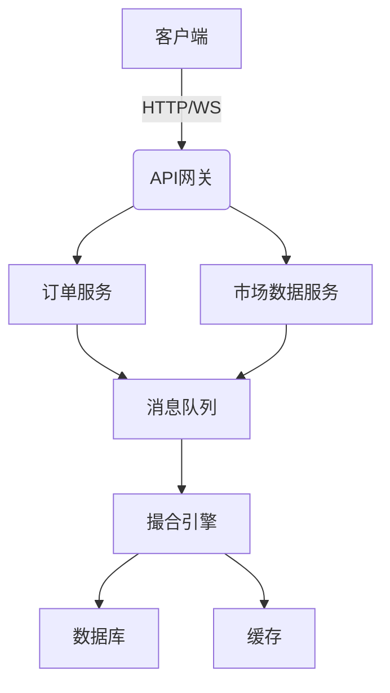
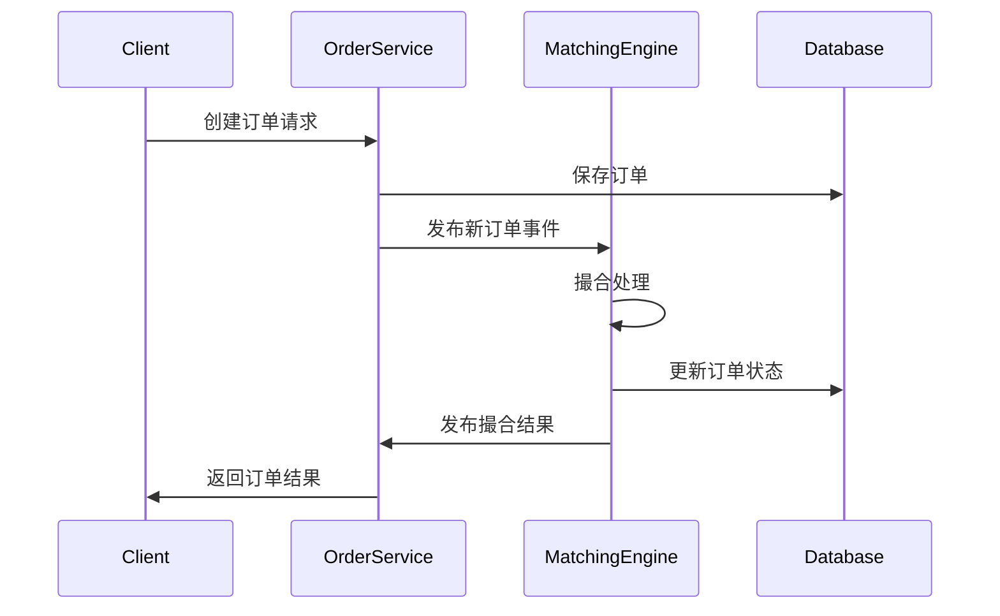
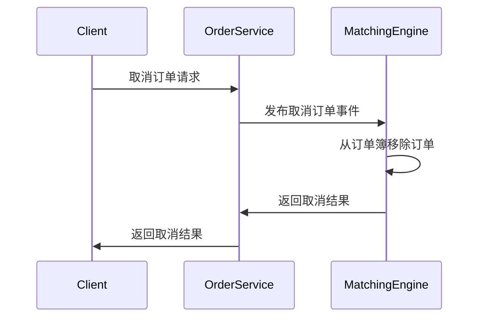

# 交易引擎技术文档

## 系统架构

## 核心模块

### 1. 撮合引擎(Matching Engine)

- 功能：负责订单的撮合处理
- 特性：
  - 支持限价单和市价单
  - 采用订单簿模型
  - 高性能撮合算法
  - 分布式部署
- 主要接口：
  - InitEngine：初始化引擎
  - Subscribe：订阅订单事件
  - OnNewOrder：处理新订单
  - OnNotifyCancelOrder：处理取消订单

### 2. 订单服务(Order Service)

- 功能：处理订单相关业务逻辑
- 主要接口：
  - 创建订单
  - 查询订单历史
  - 查询未完成订单
  - 查询交易历史

### 3. 市场数据服务(Market Data Service)

- 功能：提供市场行情数据
- 主要接口：
  - 获取深度数据
  - 获取最新成交
  - 获取K线数据

## 接口定义

### 订单服务接口

#### 1. 创建订单

- 路径：/api/v1/order/create
- 方法：POST
- 请求参数：
  - symbol: 交易对
  - side: 买卖方向(buy/sell)
  - order_type: 订单类型(limit/market)
  - price: 价格(限价单必填)
  - quantity: 数量
  - amount: 金额(市价单按金额下单时必填)

#### 2. 查询订单历史

- 路径：/api/v1/order/history
- 方法：GET
- 请求参数：
  - symbol: 交易对
  - start: 开始时间
  - end: 结束时间
  - limit: 返回条数

### 市场数据服务接口

#### 1. 获取深度数据

- 路径：/api/v1/market/depth
- 方法：GET
- 请求参数：
  - symbol: 交易对
  - limit: 深度条数

#### 2. 获取K线数据

- 路径：/api/v1/market/klines
- 方法：GET
- 请求参数：
  - symbol: 交易对
  - period: K线周期
  - start: 开始时间
  - end: 结束时间
  - limit: 返回条数

## 业务流程

### 1. 下单流程

### 2. 取消订单流程

## 性能优化

1. 使用内存订单簿，提高撮合性能
2. 采用消息队列解耦系统模块
3. 使用缓存加速市场数据访问
4. 支持水平扩展，提高系统吞吐量

## 监控指标

1. 撮合延迟
2. 订单处理吞吐量
3. 系统资源使用率
4. 订单簿深度
5. 撮合成功率
